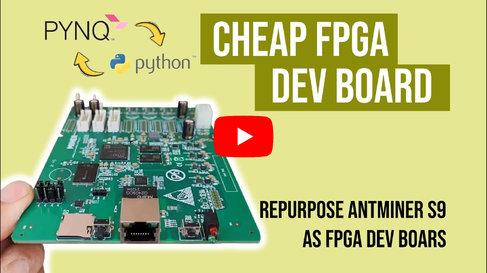

# Antminer S9 PYNQ
 Antminer S9 ZYNQ 7010 with PYNQ 2.5 FPGA Dev Board
- ▶️ Watch the video *"Repurpose Antminer S9 as FPGA Dev Board"* in Youtube,  
  
- 💿 Download PYNQ OS for Antminer S9 Control Board from, 👉 <a href="https://github.com/Muhammad-Yunus/Antminer-S9-PYNQ/releases">Release Page</a>
- 📄 Datasheet
 - You can download or view the datasheet here 👉 [Antminer S9 Datasheet PDF]([./datasheet.pdf](https://github.com/Muhammad-Yunus/Antminer-S9-PYNQ/blob/main/resource/AntMiner_ControlBoard_XC7010_V1.01%E6%8E%A7%E5%88%B6%E6%9D%BF.pdf))
#### Antminer S9 Board Layout  
  
#### Antminer S9 Pin Mapping  

